# Intermediate Results

## Coldstarts

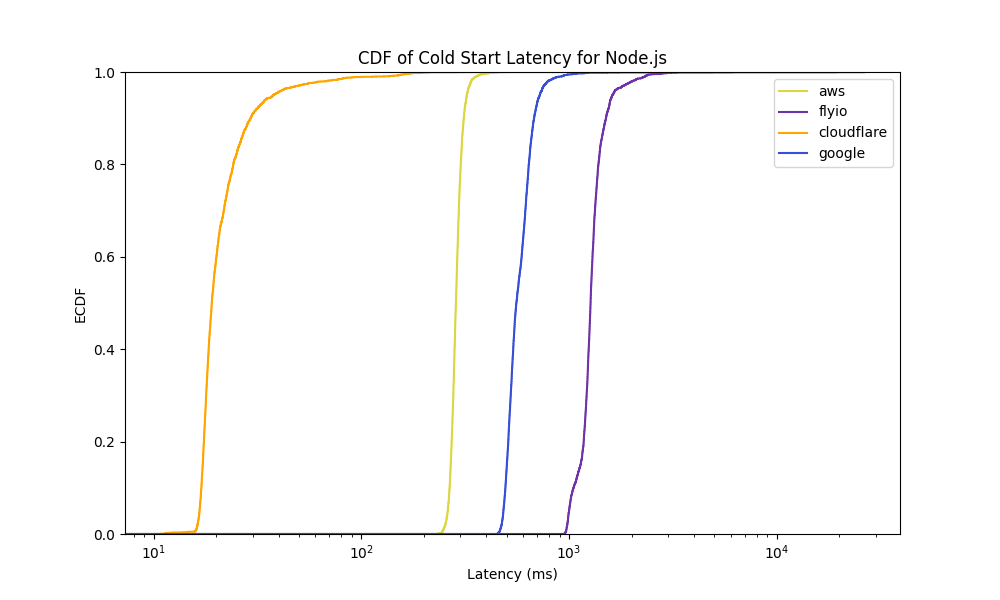

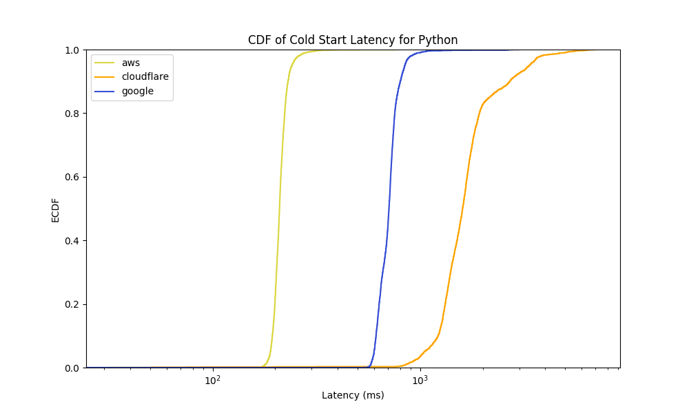

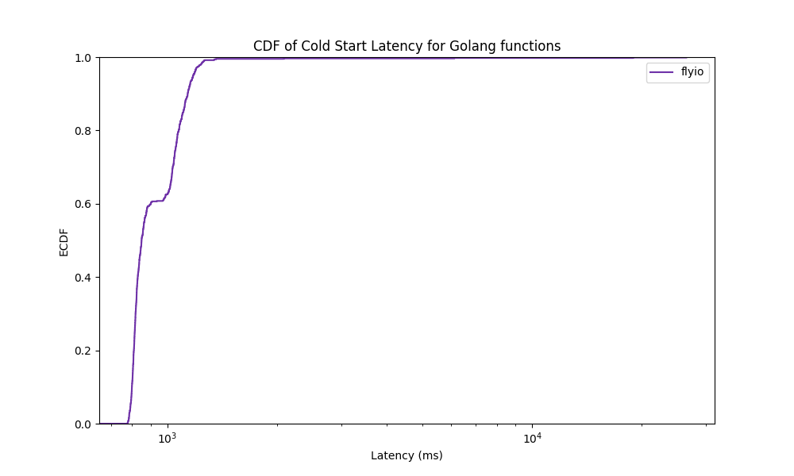

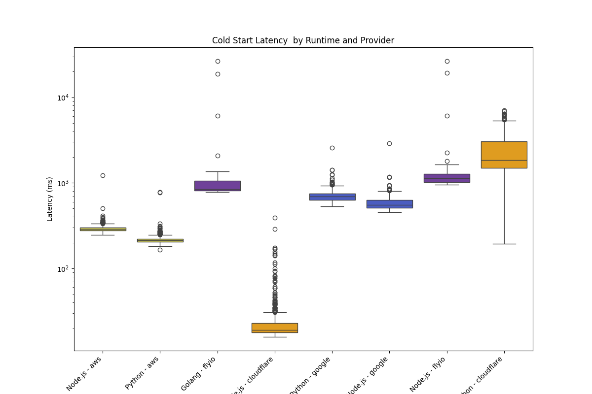

## RampUp

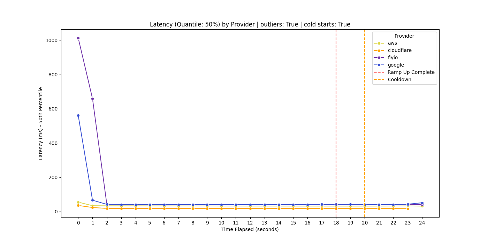

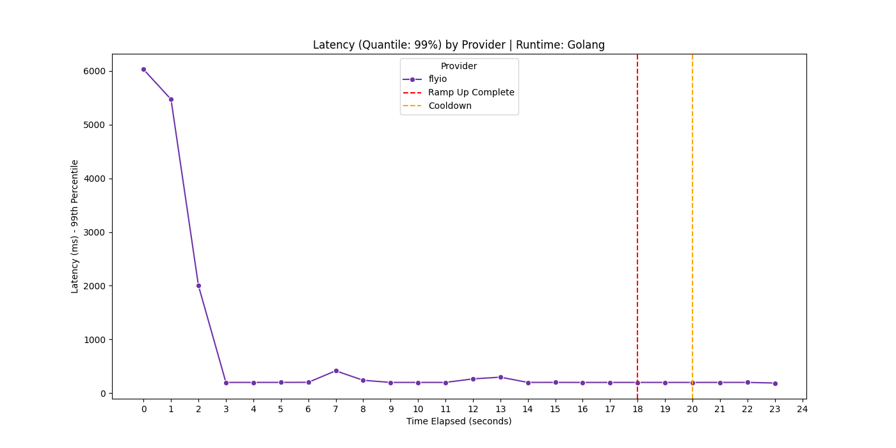

## GeoDis

### Generalised

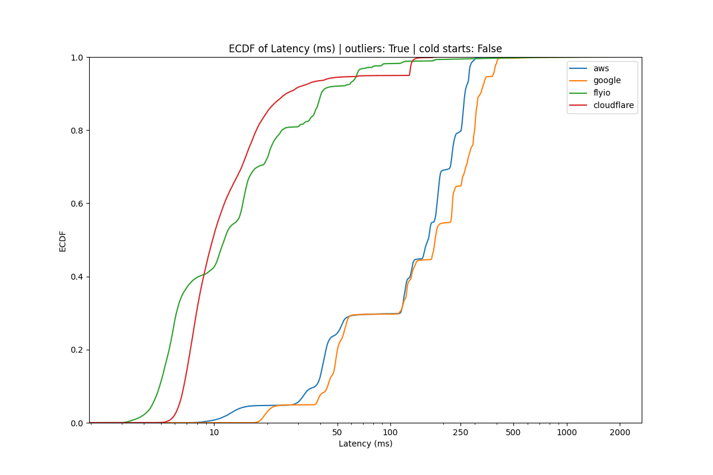

### Load Zone Group 1

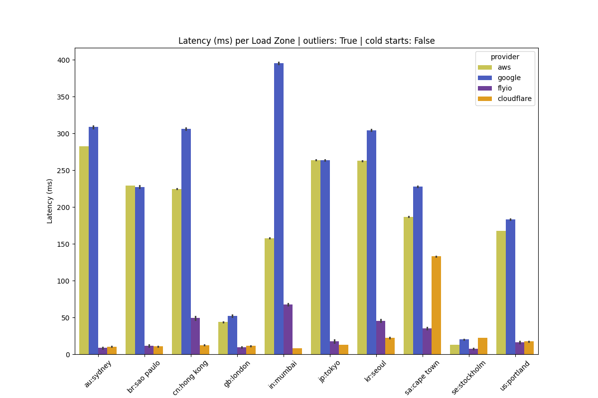

### Load Zone Group 2

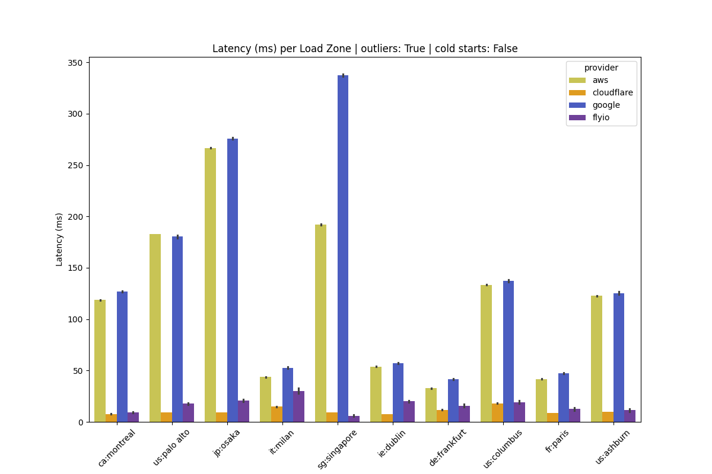
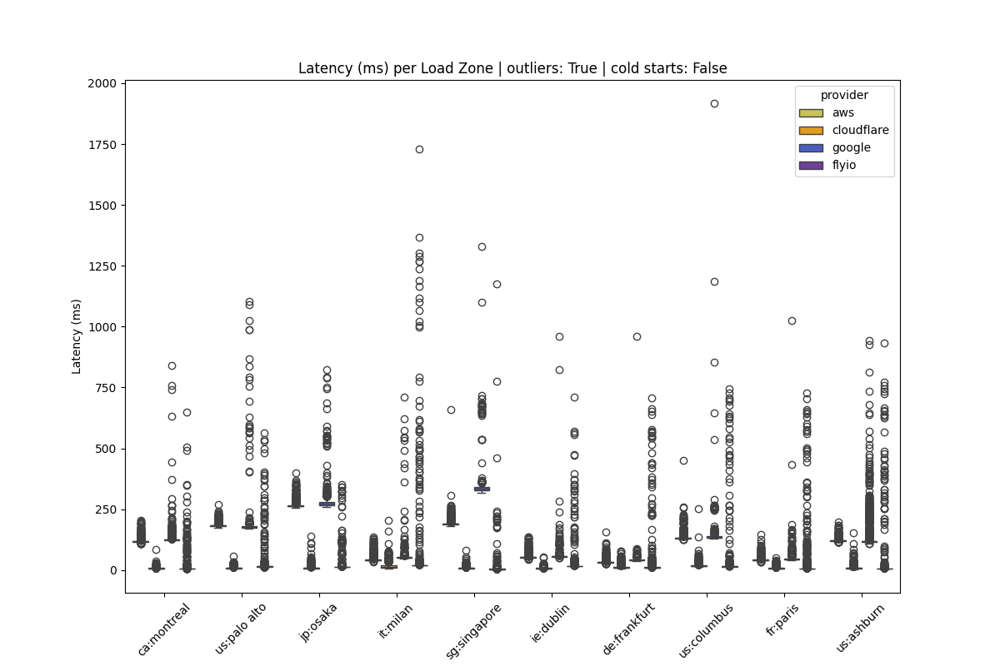

## Inline Data Transfer

Currently, there are practically no results for Flyio for this test because of a bug in the test script. Internal http requests in flyio apps can only be done with warm instances. Thus, we needed to "wake up" the consumer instance each time.

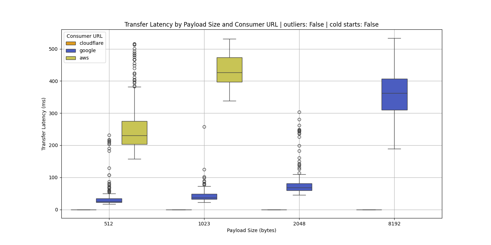
