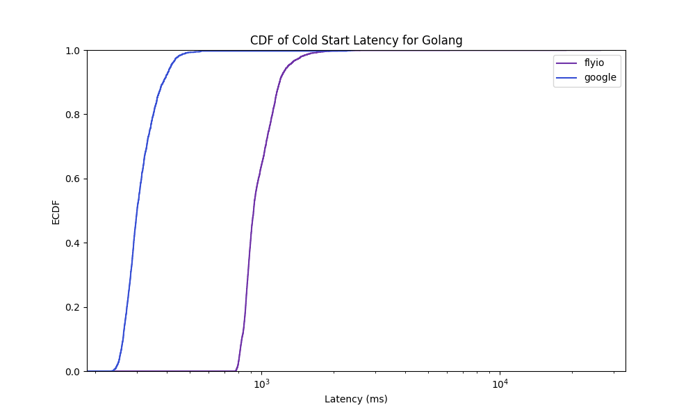

# Intermediate Results

## Coldstarts

## RampUp

## GeoDis

### Generalised

### Load Zone Group 1

### Load Zone Group 2

## Inline Data Transfer

Currently, there are practically no results for Flyio for this test because of a bug in the test script. Internal http requests in flyio apps can only be done with warm instances. Thus, we needed to "wake up" the consumer instance each time.

